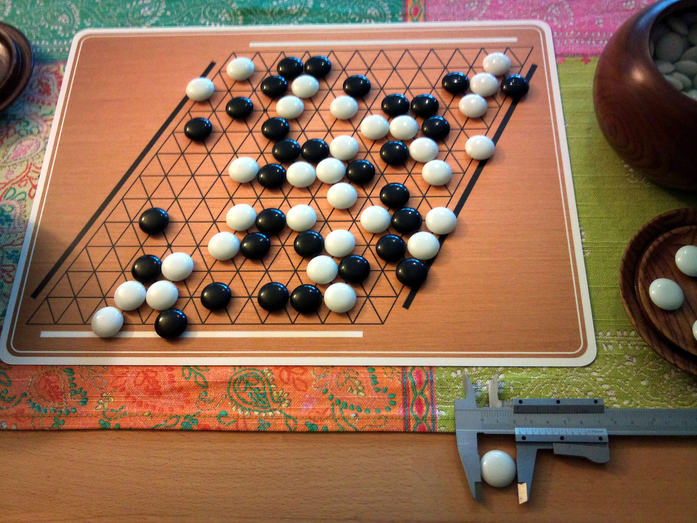
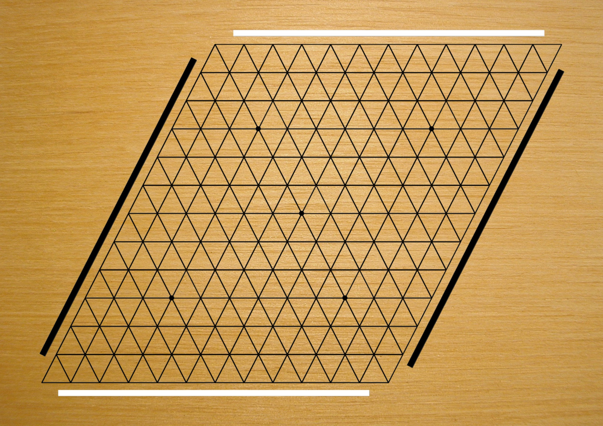

Hex
====

Hex - 2 player abstract strategic perfect information
connection board game.

#Rules

Game starts on an empty board. In alternating turns each player sets a piece of own color on an empty board position.

Objective of the game is to connect own opposite sides of the game board by an unbroken chain of pieces of own color. There is no draw situation.

_All logos, brands and trademarks mentioned belong to their respective owners._
